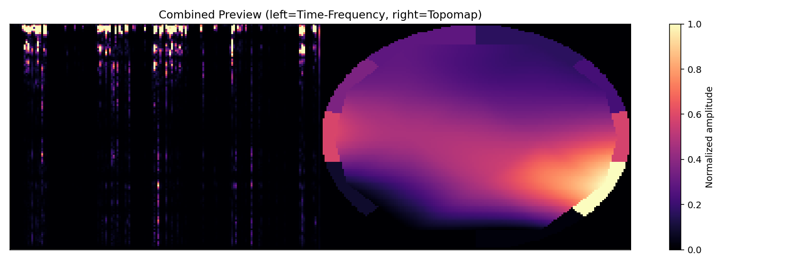

# Signal Maps Module

This module converts 1D/multichannel signals (`.wav` / `.mp3` or numpy arrays) into 2D maps for CNN workflows.

Implemented methods are separated:
- Time-frequency amplitude maps: `CWT` scalogram or `STFT` spectrogram.
- Spatial brain activity maps: EEG topographic maps.

## Quick Answers

- Number of methods: `2`
- Methods:
  - Time-frequency map method (`CWT` or `STFT`)
  - EEG topographic map method
- Number of map types produced: `2`
  - Time-frequency maps
  - Topographic maps
- When using `generate_both_maps` / `--task both`, combined outputs are also produced:
  - `combined_single_xy2.npy` with shape `(x, y, 2)`
  - `combined_frames_nxy2.npy` with shape `(n, x, y, 2)`
  - `combined_frames_xy2/` per-frame files with shape `(x, y, 2)`

## Folder Structure

- `module/signal_maps/time_frequency.py`: CWT/STFT map generation.
- `module/signal_maps/topomap.py`: EEG topographic map generation.
- `module/signal_maps/pipeline.py`: run both methods in one call.
- `module/signal_maps/cli.py`: command-line interface.

Each run creates a new folder:
- `outputs/run_YYYYMMDD_HHMMSS/`

Inside the run folder:
- `time_frequency_single.png`
- `time_frequency_frames/`
- `topomap_single.png`
- `topomap_frames/`
- `combined_single_xy2.npy` (shape: `x,y,2`)
- `combined_frames_nxy2.npy` (shape: `n,x,y,2`)
- `combined_freq.npz` (key `data`, shape: `n,x,y`, per-frame window frequency channel)
- `combined_topo.npz` (key `data`, shape: `n,x,y`, per-frame window topomap channel)
- `combined_frames_preview.png` (single visual summary of `combined_frames_nxy2.npy`)
- `combined_frames_xy2/` (per-frame `.npy`, each shape: `x,y,2`)

## Current Local Output Folder (`ouputs/`)

In this workspace, the folder `D:\jasmin\github\ouputs` currently contains:

- `ouputs/sample1/`
- `ouputs/sample2/`

Each sample folder contains:

- `audio_length.txt`: source audio duration text (sample2 is currently empty).
- `combined_frames_nxy2.npy`: stacked combined maps with shape `(n, x, y, 2)`.
- `combined_freq.npz`: frequency-channel frames (stored under key `data`).
- `combined_topo.npz`: topographic-channel frames (stored under key `data`).
- `combined_preview.png`: quick preview image of generated frames.

Example output (`ouputs/sample1`):

| File | Size (bytes) |
| --- | ---: |
| `audio_length.txt` | 5 |
| `combined_frames_nxy2.npy` | 8091008 |
| `combined_freq.npz` | 3717034 |
| `combined_preview.png` | 71185 |
| `combined_topo.npz` | 2232770 |

CLI parameters to generate this Image for Audio Lenghth 50 Sec:


```bash
python -m signal_maps \
  --input path/to/audio.wav \
  --task both \
  --output-mode medium \
  --output-dir ouputs/sample1 \
  --tf-method cwt \
  --window-sec 2.0 \
  --step-sec 1.0
```

Notes:
- `combined_preview.png` is produced when `--task both` and `--output-mode medium` (or `all`) are used.
- `combined_preview.png` is for human visual inspection only.
- The real output file is `ouputs/sample1/combined_frames_nxy2.npy`.
- `combined_frames_nxy2.npy` stores stacked 2-channel data in shape `(n, x, y, 2)`:
  channel `0` = frequency map, channel `1` = topomap.
- The exact original `--input` file used for the existing `sample1` folder is not stored in outputs.

## EEGPipeline Input Parameters and CSV Outputs

Based on your `EEGPipeline` snippet:

```python
EEGPipeline(
    data_dir="EEG_data",
    output_dir="eeg_2d_outputs",
    strategy="tenth",
)
```

- `data_dir`: folder containing input EEG `.mat` files.
- `output_dir`: folder where pipeline outputs are written.
- `strategy`: sampling strategy used by `SignalSampler`.

At initialization, these files are created (and headers reset) in `output_dir`:

- `results.csv` with columns:
  `signal_id, subject, trial, channel, attended, status, output_dir, preview`
- `labels.csv` with columns:
  `signal_id, attended`

One example `results.csv` output row:

```csv
signal_id,subject,trial,channel,attended,status,output_dir,preview
S01_T03_C07,S01,3,7,1,ok,eeg_2d_outputs/S01_T03_C07,eeg_2d_outputs/S01_T03_C07/preview.png
```

One example `labels.csv` output row:

```csv
signal_id,attended
S01_T03_C07,1
```

## Install Dependencies

```bash
pip install numpy scipy matplotlib librosa soundfile
```

## CLI Usage

Run both methods:

```bash
python -m module.signal_maps --input path/to/file.wav --task both --tf-method cwt
```

Run in medium mode (keep 2 files):

```bash
python -m module.signal_maps --input path/to/file.wav --task both --output-mode medium
```

Run in least mode (keep only one file):

```bash
python -m module.signal_maps --input path/to/file.wav --task both --output-mode least
```

Time-frequency only:

```bash
python -m module.signal_maps --input path/to/file.mp3 --task tf --tf-method stft
```

Topomap only:

```bash
python -m module.signal_maps --input path/to/file.wav --task topomap
```

Common options:
- `--output-dir outputs`
- `--window-sec 2.0`
- `--step-sec 1.0`
- `--output-mode all|medium|least`

## Output Size vs Audio Length

For `combined_frames_nxy2.npy`, shape is:
- `(n, x, y, 2)`
- `n` = number of sliding windows over the audio
- `x, y` = 2D map size after combining time-frequency and topomap outputs

With defaults `--window-sec 2.0` and `--step-sec 1.0`, for audio length `L` seconds:
- `n = floor((L - 2.0) / 1.0) + 1` (for `L >= 2.0`)

Example:
- For a `50` second file, `n = 49`
- So a typical output is `combined_frames_nxy2.npy: (49, 129, 160, 2)`

## Python Module Usage

Generate both in one new output folder:

```python
from module.signal_maps import generate_both_maps

out = generate_both_maps(
    input_file="path/to/file.wav",
    output_dir="outputs",
    tf_method="cwt",  # or "stft"
    window_sec=2.0,
    step_sec=1.0,
    output_mode="all",  # or "medium" / "least"
)

print(out.root)
print(out.time_frequency.single_file)
print(out.topomap.single_file)
print(out.combined_single_file)   # x,y,2
print(out.combined_frames_file)   # n,x,y,2
```

In `output_mode="medium"`, each run keeps only:
- `combined_frames_nxy2.npy`
- `combined_freq.npz`
- `combined_topo.npz`
- `combined_preview.png`

In `output_mode="least"`, each run keeps only:
- `combined_frames_nxy2.npy`
- `combined_freq.npz`
- `combined_topo.npz`

Run only time-frequency maps:

```python
from module.signal_maps import generate_time_frequency_maps

out = generate_time_frequency_maps(
    input_file="path/to/file.mp3",
    method="stft",
)
```

Run only topographic maps:

```python
from module.signal_maps import generate_topographic_maps

out = generate_topographic_maps(
    input_file="path/to/file.wav",
)
```

Use in-memory numpy signal data:

```python
import numpy as np
from module.signal_maps import generate_both_maps

fs = 256
signal = np.random.randn(fs * 10)
out = generate_both_maps(signal_data=signal, sample_rate=fs)
```

## Backward Compatibility

`signal_to_2d_maps.py` now forwards to the new package.
